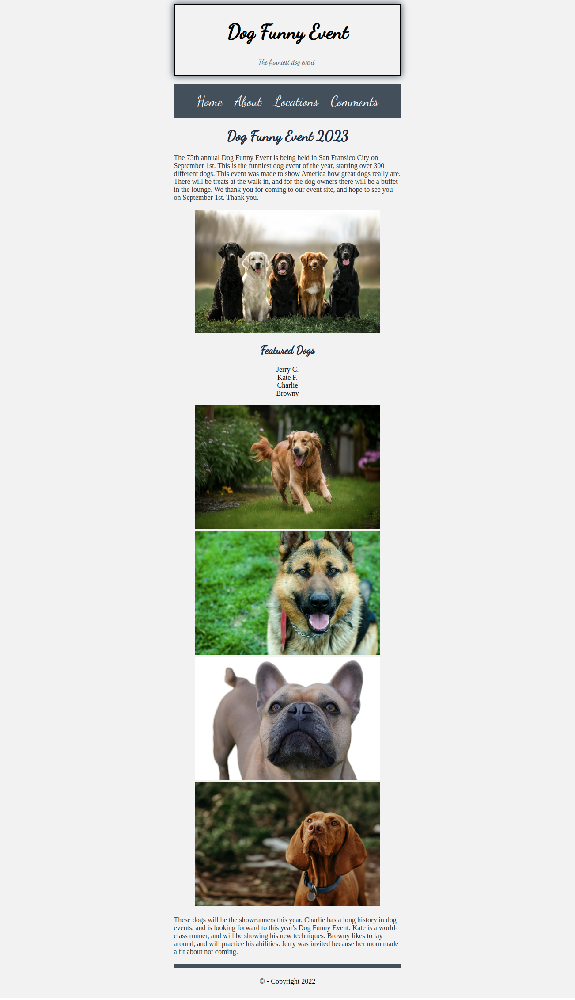

## Assessment 1: Style the web event page

This assessment is based on the following 3 prints of the HTML courses: Building responsive web pages using HTML5 and CSS3.

- Sprint-1: Develop a web page using HTML
- Sprint-2: Structure a web page using semantic HTML5 elements
- Sprint-3: Style a web page using CSS properties and CSS box model

## Context

The Rainbow Event Planners have organized a web event for pet dogs. The web developer team of the company have created a home page to broadcast this event. You being the part of this team, have been assigned the task of styling the page to attract good viewership.

## Problem Statement

Style the web event home page using CSS3 properties for pleasing user-experience. 

**The expected output for Home page should resemble the following image:**




### Details

**Color codes and fonts used for the web page are as follows:**

- Header Paragraph text color, Top Navbar background color, Footer border and Header box-shadow color: #434f5b
- Body background color, Top navbar anchor elements: #f2f2f2
- Font used is 'Dancing script', cursive
- All the required images are available inside the `images` folder
- Following are the texts used in the web page

```
The 75th annual Dog Funny Event is being held in San Fransisco City on September 1st. This is the funniest dog event of the year, starring over 300 different dogs. This event was made to show America how great dogs really are. There will be treats at the walk in, and for the dog owners there will be a buffet in the lounge. We thank you for coming to our event site, and hope to see you on September 1st. Thank you.

These dogs will be the showrunners this year. Charlie has a long history in dog events, and is looking forward to this year's Dog Funny Event. Kate is a world-class runner, and will be showing his new techniques. Browny likes to lay around, and will practice his abilities. Jerry was invited because her mom made a fit about not coming

```
