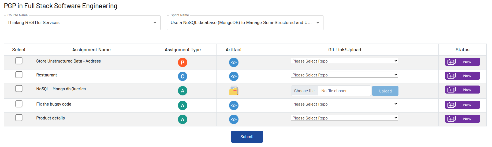

# Instructions to be followed:

- Fork the boilerplate into your namespace `https://myrepos.stackroute.niit.com/backend-assessment-v3/c3-thinking-restful-services/s1-use-a-nosql-database-mongodb-to-manage-semi-structured-and-unstructured-data/assessment-1-debug-the-code.git`
- Clone the boilerplate
- Write the solution and push to your own repository
- Submit the assessment on RaaS


# Submission Instructions for RaaS

- Login to LMS ```https://www.niit.com/india/```
- Navigate to **My Programs**
- Click on the **Submit Assignment** button to navigate to RaaS.
- Select the Course `Thinking RESTful Services` from the Course Name drop down.
- Select the Sprint  `Use a NoSQL database (MongoDB) to Manage Semi-Structured and Unstructured Data` from the Sprint Name drop down.
- Select the Repository from the Git Link drop down for the specific assessment.
- Click on the checkbox of the assessment to be submitted and Submit for Review.


