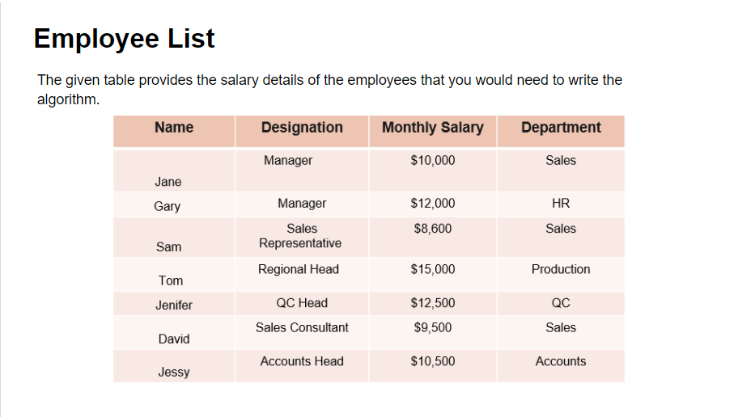
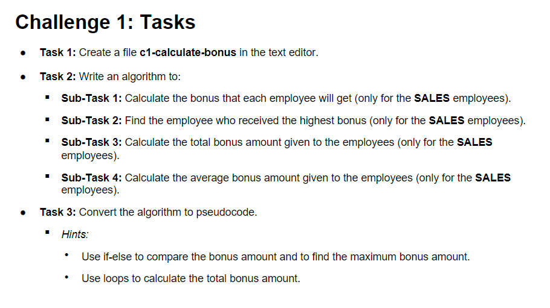
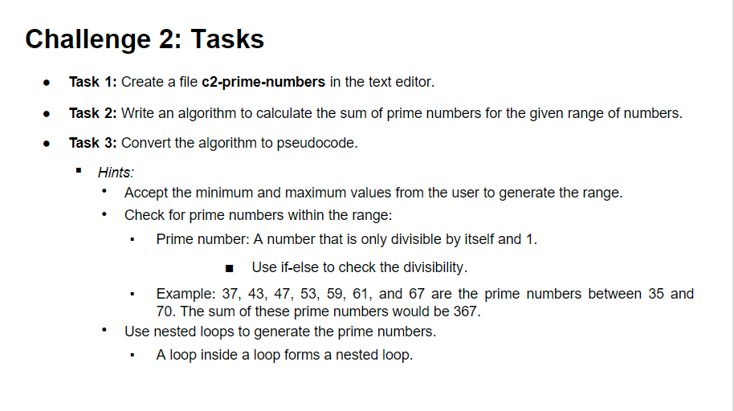

# Algorithm and Pseudocode Challenge

## Challenge 1: Calculate the Bonuses for the Employees

### Algorithm

- **Step1**: Start
- **Step2**: Accept n as number of employees
- **Step3**: Initialize totalBonus to 0, highestBonusAmt to 0, highestBonusName to NULL, salesEmployeeCount to 0
- **Step4**: Accept employee data
- **Step5**: If the employee is from Sales, then perform Steps 6,7 and 8
- **Step6**: Calculate and display individual employeeBonus = 0.02*monthlySalary
- **Step7**: If employeeBonus is greater than highestBonusAmt, then assign employeeBonus to highestBonusAmt and employee name to highestBonusName
- **Step8**: Add employeeBonus to totalBonus and increment salesEmployeeCount
- **Step9**: Repeat Steps 4,5,6,7,8 for all n employees
- **Step10**: Display totalBonus, highestBonusName with highestBonusAmt and averageBonus equal to totalBonus/salesEmployeeCount
- **Step11**: End

### Pseudocode

    BEGIN
        GET employeeCount
        SET totalBonus = 0, highestBonusAmt = 0, highestBonusName = NULL, salesEmployeeCount = 0
        FOR i = 1 to employeeCount STEP 1
        DO
            GET employeeData
            IF employeeData.Department == "Sales"
            BEGIN
                SET employeeBonus = 0.02 * employeeData.monthlySalary
                PRINT employeeData.Name + ":" + employeeBonus
                totalBonus = totalBonus + employeeBonus
                salesEmployeeCount = salesEmployeeCount + 1
                IF employeeBonus > highestBonus
                BEGIN
                    highestBonus = employeeBonus
                    highestBonusName = employeeData.Name
                ENDIF
            ENDIF
        ENDFOR
        SET avgBonus = totalBonus / salesEmployeeCount
        PRINT "Average Bonus:" + avgBonus
        PRINT "Highest Bonus:" + highestBonusName + ":" + highestBonusAmt
        PRINT "Total Bonus:" + totalBonus
    END

## Challenge 2: Calculate the Sum of Prime Numbers

### Algorithm

- **Step1**: Start
- **Step2**: Accept rangeMin and rangeMax
- **Step3**: Initialize sum to 0 and counter to rangeMin
- **Step5**: Iterate using i between numbers 2 and square root of counter and check if counter is not divisible by i, if so add counter to the sum
- **Step6**: Increment counter and repeat step5 till counter is less than equal to rangeMin
- **Step7**: Display sum
- **Step8**: End

### Pseudocode

    BEGIN
        GET rangeMin, rangeMax
        SET sum = 0
        FOR counter = rangeMin to rangeMax STEP 1
        DO
            SET isPrime = TRUE
            FOR i = 2 to sqrt(counter) STEP 1
            DO
                IF counter % i == 0
                BEGIN
                    isPrime = FALSE
                ENDIF
            ENDFOR
            IF isPrime == TRUE
            BEGIN
                sum = sum + counter
            END
        ENDFOR
        PRINT sum
    END
