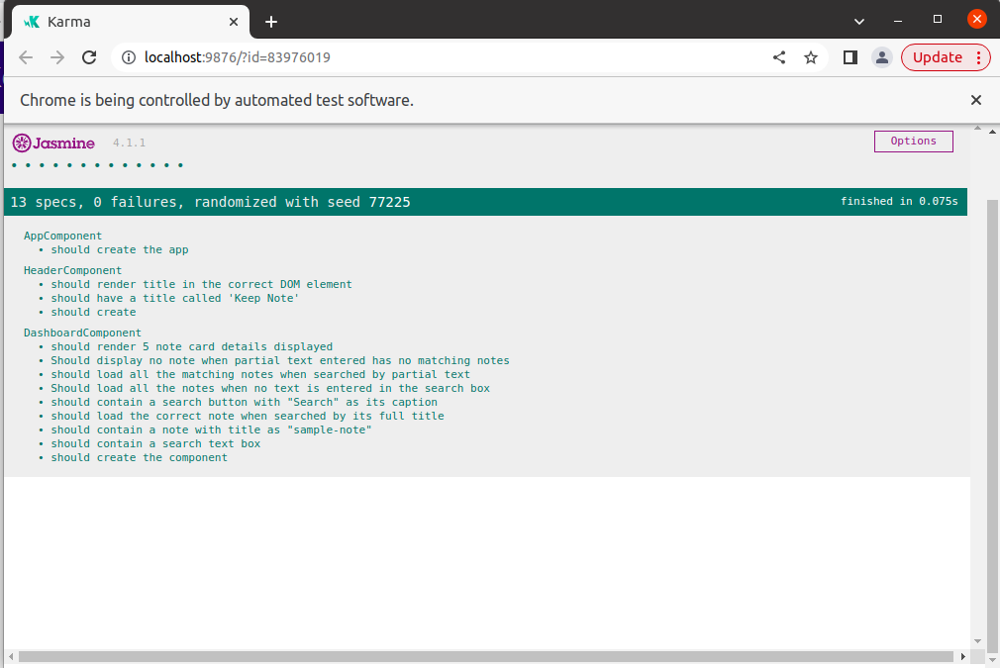

## Enable Testing for Keep Note Application

### Context

Keep Note is a web application that lets users maintain notes. It should be designed as a single-page application (SPA). ​

​The Keep Note application reads notes from an array which is declared in a separate file. For convenience, the application provides search functionality to allow users to search for notes by the title of the note. ​

​The components created in the Keep Note Application should be tested to ensure a quality product. ​

### Problem Statement

Create test cases to enable testing for the solution of Keep Note Application.​​
The test code should ensure: ​
  - The expected title is available in the Header component.  ​
  - The Dashboard component displays the list of notes.​
  - The Dashboard Component enables the search for notes as expected.​

#### Tasks

Following are the tasks to complete this exercise:​
- Task 1: Test App Component​
- Task 2: Test Header Component​
- Task 3: Test Dashboard Component

Copy the solution of the Keep Note application created for the `fe-c4-s2-components-challenge` of Sprint – `Develop SPA Using Angular Components` into the root folder.

#### Task 1: Test App Component
- Write the test code to test whether the app component is instantiated successfully.​

#### Task 2: Test Header Component​
- Write the test code to test whether ​
   - the component is instantiated successfully​,
   - title `Keep Note` is displayed as expected.​
- Refactor the application code to achieve the expected result if the test cases are failing.

#### Task 3: Test Dashboard Component​
- Write the test code to test various functionality of Dashboard component as given below.

|Functionality|Test Conditions|
|---|---|
|Display Notes|Should render 5 note card details​|
|Display Notes|should contain a note with title as "sample-note"|
|Search Notes|Should contain a search text box|
|Search Notes|should contain a search button with "Search" as its caption|
|Search Notes|should load the correct note when searched by its full title|
|Search Notes|should load all the matching notes when searched by partial text|
|Search Notes|Should load all the notes when no text is entered in the search box|
|Search Notes|Should display no note when partial text entered has no matching notes|

- Refactor the application code to achieve the expected result if the test cases are failing.

**Expected output: Screenshot of the report generated by Karma Test Runner**

