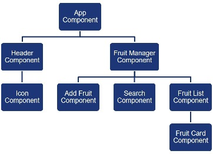
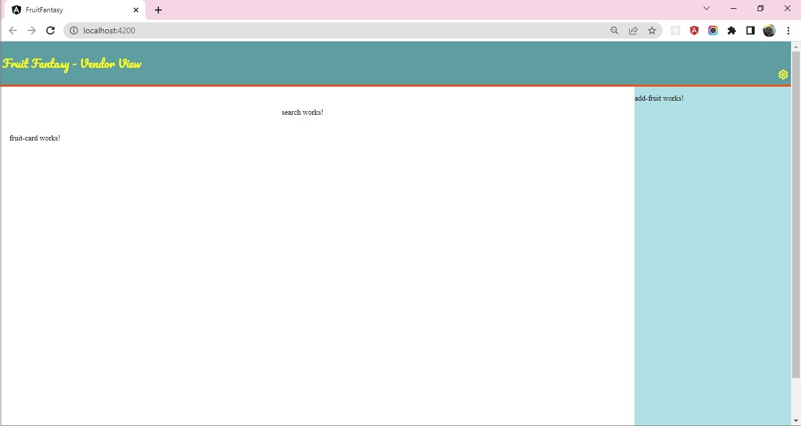

### Demo 1 :: Create Components for Fruit Fantasy

#### Guidelines to identify components
1. Use Single Responsibility Principle and Do not Repeat Yourself principle to identify components
2. Header of the page should only display page headings with icons
    - `Header` would be one component.
3. There could be multiple icons in the header each serving a specific responsibility, with same look and feel.
    - `Icon` could be another component rendered by the `Header` component.
4. The main section of the page, need to manage fruit data residing in the `Fruits` array externally.
    - `Fruit Manager` component can be created that reads data from the external fruit array.
5. Following are the key tasks that would be performed on the fruit data:
    - Add fruit
    - Search fruit
    - Display fruit list 
    - Each item in the list should be displayed with its caption, price and fruit image
6. Each of the above tasks would be handled as a single responsibility by the following components:
    - Add-Fruit component
    - Search component
    - Fruit-List component
    - Fruit-Card component

#### Identifying Relationship between components to build Component Hiearchy

1. App component is the bootstrap component which would be the root in the component hiearchy.
2. Header and Fruit-Manager would be rendered by App component, that makes them children of App component.
3. Header renders Icon component, hence Icon is child of Header component
4. Fruit-Manager component has to manage fruits through add, search and display operations.
    - Hence `Add-Fruit`, `Search` and `Fruit-List` are the children of `Fruit-Manager` component
5. The `Fruit-List` component renders fruits as card through `Fruit-Card` component, making `Fruit-Card` the child of `Fruit-Manager` component

The complete hiearchy can be created as depicted by the component hiearchy diagram shown below:

Use Angular CLI command `ng generate component <component-name>` or `ng g c <component-name>` to create components.

Render the components as per the relationship depicted in the hierarchy.

Also, ensure the models `Fruit` and `Fruits` are re-created as created in the previous sprint demo.

Copy the code for designing header in the `Header` component.

Copy the code for displaying `settings` icon in the `Icon` component.

Below is the snapshot of expected output:

