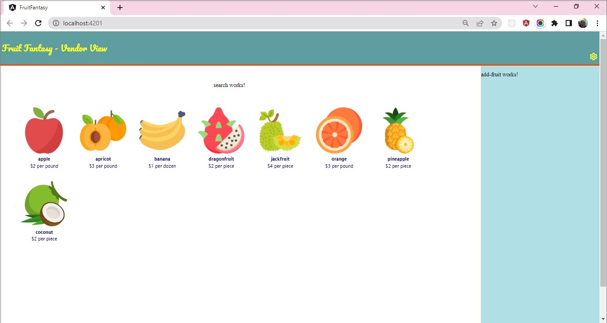

### Demo 2 :: Fruit Fantasy - Display List of Fruits

#### Implementation Steps

1. **`Fruit-Manager` Component**
    1. In `.ts` file, create `fruits` array property and to it assign the FRUITS array exported from the `models/fruits.ts` file.
    2. In the `.html` file, pass the fruits array property to the `fruits` property of the `Fruit-List` component.
    ```html
        <app-fruit-list [fruits] = "fruits"></app-fruit-list>
    ```
2. **`Fruit-List` Component**
    1. In `.ts` file, declare `fruits` property of type `Fruit` array and annotate it with `@Input()` decorator to mark this property as input property. This will allow the `fruits` property to receive inputs from the parent (`Fruit-Manager`) component.
    ```javascript
        @Input()
        fruits: Fruit[] = [];
    ```
    **Note: `Input` should be imported from `@angular/core` module.**

    2. In the `.html` file, render `Fruit-Card` component using `*ngFor` directive to render one instance each for the fruit traversed.
    3. Pass the `fruit` object traversed as input to `fruit` property of `Fruit-Card` component.

    ```html
        <app-fruit-card class="card" *ngFor="let fruit of fruits" [fruit] = "fruit">
    
        </app-fruit-card>
    ```
    4. In the `.css` file, add the following CSS class to style
    ```css
        .card {
            display: inline-flex;
            align-items: flex-start;
        }
    ```
3. **`Fruit-Card` Component**
    1. In the `.ts` file, declare `fruit` property of type `Fruit` and annotate it with `@Input()` decorator to mark this property as input property and enable it to receive input from the parent (`Fruit-List`) component.
    ```javascript
        @Input()
        fruit?: Fruit;
    ```
    2. In the `.html` file, render `fruit name`, `image`, `price` and `unit` fields.
    ```html
        <a href="">
            <div class="card-content">
                
                <h4>{{fruit?.name}}</h4>
                ${{fruit?.price}} per {{fruit?.unit}}
            </div>
        </a>
    ```
    3. In the `.css` file, add the following CSS class to style
    ```css
        .card-content{
            text-align: center;
            margin: 15px;
            padding: 3px;
            height: 170px;
        }

        .card-content h4 {
            margin-block-start: 0.5em !important;
            margin-block-end: 0.5em !important;
        }

        a {
            text-decoration: none;
            color: navy;
            font-family: 'Lucida Sans', 'Lucida Sans Regular', 'Lucida Grande', 'Lucida Sans Unicode', Geneva, Verdana, sans-serif;
            font-size: 0.75em;
        }
    ```

Below is the snapshot of expected output:

