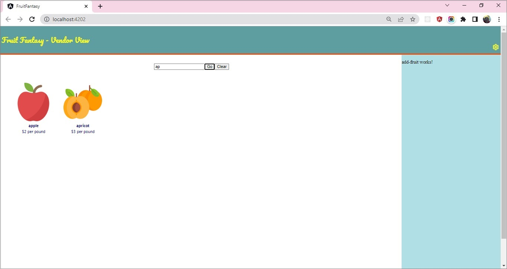

### Demo 3 :: Fruit Fantasy - Search Fruit in Fruit-List

#### Implementation Steps

1. **`Search` Component**
    1. In the `.html` file, design search layout with text box and two buttons - `Go` and `Clear`
        ```html
            <div class="search-box">
                <input type="text" placeholder="Enter fruit name" name="fruitName">
                <button>Go</button>
                <button>Clear</button>
            </div>
        ```
    2. In the `.ts` file, declare property `fruitName` of type `string`.
    3. In the `.html`, implement 2-way binding using `ngModel` between the search text box and the property `fruitName`.
        - **Note: To use `ngModel` import `FormsModule` in `app.module.ts` from `@angular/forms`.
        ```html
        <input type="text" placeholder="Enter fruit name" name="fruitName" [(ngModel)] = "fruitName">
        ```
    4. In the `.ts` file, define two functions `searchFruit()` and `clearSearch()`
        ```javascript
            searchFruit() {

            }

            clearSearch() {
                
            }
        ```
    5. In the `.html` file, associate these methods with `click` event of `Go` and `Clear` buttons respectively.
        ```html
            <button (click)="searchFruit()">Go</button>
            <button (click)="clearSearch()">Clear</button>
        ```
    6. When the `Go` button is clicked, the search text should be passed to the parent component by emitting an event. 
    
    In the `.ts` file, to emit event, declare output property `searchTextChanged` of  the type `EventEmitter` annotated with the`@Output()` decorator
        ```javascript
            @Output()
            searchTextChanged: EventEmitter<string> = new EventEmitter<string>();
        ```
    **Note: `Output` should be imported in component class from `@angular/core` module.**
    7. In the `.ts` file, complete the code in `searchFruit()` method that will get called when the `Go` button is clicked. The code should emit the `searchTextChanged` event with a fruit name value to the parent component.
        ```javascript
        searchFruit() {
            this.searchTextChanged.emit(this.fruitName);
        }
        ```
    8. In the `.ts` file, complete the code in `clearSearch()` method that will get called when the `Clear` button is clicked. The code should emit the `searchTextChanged` with empty fruit name value.
        ```javascript
        clearSearch() {
            this.fruitName = "";
            this.searchTextChanged.emit(this.fruitName);
        }
        ```
    
2. **`Fruit-Manager` Component**
    1. The event emitted by child component `Search` should be listened and handled by the parent `Fruit-Manager` component.
    2. In the `.html` file, implement event binding to listen to the event and associate an event handler
    ```html
    <app-search (searchTextChanged)="onSearchTextChanged($event)"></app-search>
    ```
    - **Note**: Here `$event` receives the fruit name passed by the child component while emitting the event.
    3. In the `.ts` file, declare `onSearchTextChanged()` method
    ```javascript
    onSearchTextChanged(fruitName: string) {

    }
    ```
    4. The `onSearchTextChanged()` method should filter `fruits` array based on fruit name passed. However, if the fruit name is empty then it should reset `fruits` array with original values from `FRUITS` array
    ```javascript
    onSearchTextChanged(fruitName: string) {
        if(fruitName === '' || !fruitName)
            this.fruits = FRUITS;
        else
        {
            this.fruits = FRUITS;
            this.fruits = this.fruits.filter(fruit => fruit.name?.startsWith(fruitName));
        }
    }
    ```
    - **Note:** As the `fruits` array gets updated with search results, the same array is passed as an input to the `Fruit-List` component. The `Fruit-List` component then renders the `Fruit-Card` components with updated list contents.

    
Below is the snapshot of expected output:

