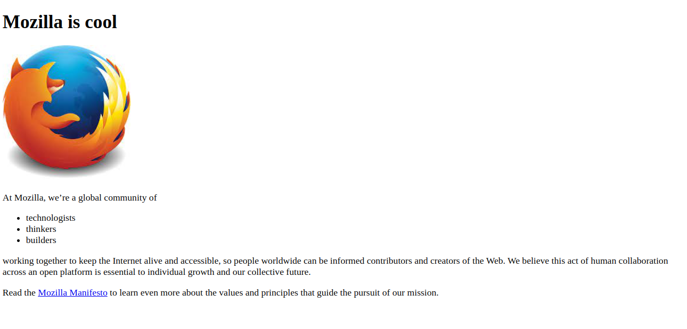

# Create the Home Page

## Context

Web design identifies the goals of a website or webpage which can be quite complex and daunting. But with the development of the internet and technology, web design can be easier than ever before nowadays. This process involves organizing content and images across a series of pages that integrates applications using interactive elements.

Many webpages are designed with a focus on simplicity, so that no irrelevant information and functionality that might divert or confuse users appears. A good web design is easy to use and aesthetically pleasing for the end users.

You are required to create a simple web page step by step which enables you to understand what it is like to mark up a document with HTML tags. It will be an extremely simple web page, but even the most complicated pages are based on the same principles that are used here.

### Problem Statement

Create a simple web page using HTML’s heading, paragraph, image, list, and anchor elements.​

Create a replica of a simple web page as shared in the image below.



### Tasks:

To develop the solution, following tasks need to be completed:​​​

- Task 1: Create folder structure​
- Task 2: Create HTML document​
- Task 3: Add heading​
- Task 4: Add image​
- Task 5: Add paragraph​
- Task 6: Add list​
- Task 7: Add more paragraphs​
- Task 8: Add hyperlink​


#### Task 1: Create Folder Structure

- Create a folder on the desktop with the name `p1-first-web-page` by following the steps given below:​
    - Right click on the Desktop.​
    - Select the option “New”.​
    - Select the option “Folder”​
    - Give the name to the folder as `p1-first-web-page`.​

 - In `p1-first-web-page` folder, create sub-folder with the name images by following the steps given below:​
    - Double click on the folder `p1-first-web-page` to open Windows Explorer.​
    - Right click on the blank white area.​
    - Select the option “New” ​
    - Select the option “Folder”.​
    - Give the name to the folder as “images”.
    - Double click on the `images` folder of the boilerplate to open it and right click on the `firefox-icon.jpeg` image. 
    - Choose the option Save image as to save the image in the `images` folder.​
    - Finally, Open Notepad and save the file with the name `index.html` in the `p1-first-web-page` folder.

#### Task 2: Create HTML Document

- In the file `index.html`, create HTML document with head and body sections using `<head>` and `<body>` tags.
    ```html
    <!DOCTYPE html>
    <head>

    </head> 
    <body>  

    </body> 
    </html>
    ```
#### Task 3: Add Heading

- In the index.html file, inside the `<body>` tag, add `<h1>` tag to create page heading as shown below:​
   ```html
   <h1>Mozilla is cool</h1>​
- Save `index.html` file by clicking on Save option available in the File menu.​
- From the Windows Explorer double click on the `index.html` file to view the output in the browser.

#### Task 4: Add Image

- Inside the `<body>` tag, add `` tag to add an image in the web page.​
- The image should appear after the header text "Mozilla is cool".​
- The source of the image to be added is the file `firefox-icon.jpeg` available inside the `images` folder. Code to be added is as shown below:​
    ```html
    ​
- On the browser, refresh the page by pressing the function key F5.

#### Task 5: Add Paragraph

- Inside the `<body>` tag, add `<p>` tag to add paragraph in web page.​
- Add the following text for the paragraph​: `At Mozilla, we’re a global community of​`
- The paragraph should appear after the Mozilla image by adding the below code:​
    ```html
    <p> At Mozilla, we’re a global community of </p>
    ```
- On the browser, refresh the page.

#### Task 5: Add List

- Inside the `<body>` tag, add `<ul>` tag to add unordered list in the web page after the paragraph added in the previous task.
- Following list items should be added to the unordered list.​
    - technologists​
    - thinkers​
    - builders
- The list items should be added using the `<li>` tag as shown below:​
    ```html
     <ul> 
      <li>technologists</li>
      <li>thinkers</li>
      <li>builders</li>
    </ul>
    ```
- On the browser, refresh the page to get the expected output.

#### Task 5: Add More Paragraphs

- Inside `index.html` file, add two more `<p>` tags to finalize the page contents.​
- The text for the first paragraph is as follows​:
"working together to keep the Internet alive and accessible, so people worldwide can be informed contributors and creators of the Web. We believe this act of human collaboration across an open platform is essential to individual growth and our collective future.​"
- The text for the second paragraph is as follows:
"Read the Mozilla Manifesto to learn even more about the values and principles that guide the pursuit of our mission."

#### Task 6: Add Hyperlink

- Inside the `<body>` tag, change the text “Mozilla Manifesto” in last paragraph to hyperlink using `<a>`- anchor tag​
- The hypertext should link to webpage available at location `https://www.mozilla.org/en-US/about/manifesto/`
- The anchor tag should be added as shown below:
    ```html
       <a href="https://www.mozilla.org/en-US/about/manifesto/">Mozilla Manifesto</a>
- Open the page in the browser to check the output. 


