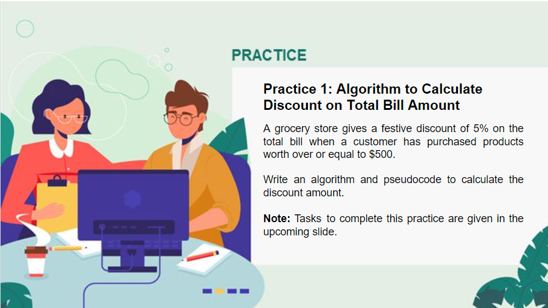
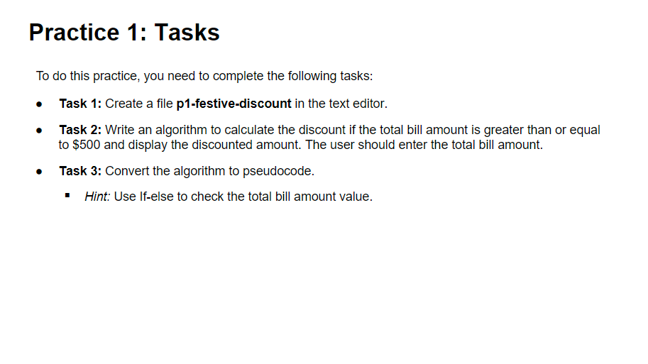

# Algorithm and Pseudocode Practice

## Practice 1: Calculate Discount on Total Bill Amount

### Algorithm

- **Step1**: Start
- **Step2**: Accept totalBill
- **Step3**: Check if totalBill is greater than or equal to $500 then calculate discounted amount as 95% of totalBill
- **Step4**: Display discounted bill
- **Step5**: End

### Pseudocode

    BEGIN
        GET totalBill
        SET discountedBill = totalBill
        IF totalBill >= 500
        BEGIN
            SET discountedBill = 0.95*totalBill
        ENDIF
        PRINT discountedBill
    END

## Practice 2: Algorithm to Display Bank Account Balance

### Algorithm

- **Step1**: Start
- **Step2**: Set accountBalance to 5500
- **Step3**: Accept withdrawlAmount
- **Step4**: Display (accountBalance - withdrawlAmount)
- **Step5**: Check if (accountBalance - withdrawlAmount) is less than $100 then tell user that the account is frozen
- **Step6**: End

### Pseudocode

    BEGIN
        SET accountBalance = 5500
        GET withdrawlAmount
        PRINT "Balance:" + (accountBalance - withdrawlAmount)
        IF accountBalance - withdrawlAmount < 100
        BEGIN
            PRINT "Account Balance less than $100. Account frozen!"
        ENDIF
    END
